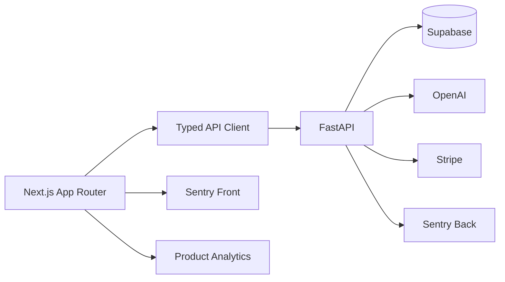

# Product Rewrite Architecture Spec
기준 저장소: `/Users/taeksoojung/Desktop/RutineIQ`
기준일: 2026-02-19

## 1) Current Constraints (Code-fact)
- Web: Next.js App Router + React 18 + SWR + Tailwind
- API: FastAPI + Supabase REST/Auth + Stripe + OpenAI
- Risk hotspots:
  - `/app/insights/page.tsx` 대형 단일 파일
  - `/app/daily-flow/page.tsx` 대형 단일 파일
  - `/app/reports/[date]/page.tsx`에서 분석/표시/캐시 로직 혼재
  - `AppSettingsPanel`에 민감 작업(삭제/탈퇴/결제) 집중

## 2) Target Runtime Architecture


### Frontend Layers
- `app/`: route composition, auth gate, boundaries
- `features/`: 화면별 business logic (`hooks`, `selectors`, `types`)
- `components/`: pure UI components
- `lib/`: cross-feature utilities (`api-client`, `date-utils`, `report-utils`, `analytics`)
- `services/`: external SDK wrappers (Supabase/Stripe)

### Backend Layers
- `routes/`: transport + validation
- `services/`: domain logic and integrations
- `schemas/`: response/request contracts
- `core/`: config, security, middleware

## 3) State Ownership Map
```text
Route State (per page)
├─ TodayState (today/page.tsx)
├─ DailyFlowState (daily-flow/page.tsx)
├─ ReportState (reports/[date]/page.tsx)
└─ SettingsState (settings/*)

Shared Runtime State
├─ SWR Cache (/logs,/reports,/insights/weekly)
├─ Locale Context (LocaleProvider)
└─ Auth Session (Supabase)

Server Truth
├─ profiles
├─ activity_logs
├─ ai_reports
└─ subscriptions
```

규칙:
- 전역 store 도입은 보류; 화면 간 공유는 SWR key와 URL state로 제한
- 계산 상태는 effect가 아니라 render-time selector 우선
- transient value(AbortController, timers)는 `useRef`

## 4) API Client Standard
- Required headers: `Authorization`, `x-correlation-id`, `content-type`
- Timeout:
  - GET/HEAD: 12s
  - POST/PUT/PATCH/DELETE: 45s (탈퇴 120s 예외)
- Retry:
  - timeout + idempotent method 1회
- Abort:
  - analyze/parse처럼 장시간 작업은 반드시 cancel 가능
- Error normalization fields:
  - `message`, `hint`, `code`, `status`, `correlationId`

## 5) Routing Contract
- Canonical routes:
  - `/app/today`
  - `/app/log`
  - `/app/reports/:date`
  - `/app/plan`
  - `/app/billing`
  - `/app/settings/{profile,notifications,privacy,account}`
- Legacy compatibility:
  - `/app/insights` -> today alias
  - `/app/daily-flow` -> log alias
  - `/app/preferences` -> `/app/settings/profile`

## 6) Error and Loading Boundaries
- Root: `/Users/taeksoojung/Desktop/RutineIQ/apps/web/src/app/error.tsx`
- Add app-level boundaries:
  - `/Users/taeksoojung/Desktop/RutineIQ/apps/web/src/app/app/error.tsx`
  - `/Users/taeksoojung/Desktop/RutineIQ/apps/web/src/app/app/loading.tsx`
- UX policy:
  - 사용자 친화 메시지 + 기술 상세 토글
  - correlation id가 있으면 표시(지원 대응용)

## 7) Security Baseline
- Next response headers:
  - `Content-Security-Policy`
  - `X-Frame-Options: DENY`
  - `Referrer-Policy: strict-origin-when-cross-origin`
  - `X-Content-Type-Options: nosniff`
- Backend:
  - correlation id propagation
  - 민감 엔드포인트 rate limit (`/preferences/account`, `/analyze`)
  - PII masking in error logs

## 8) Performance Baseline
- Page budget (mobile cold):
  - TTI < 3.5s
  - LCP < 2.8s
- rules:
  - heavy section dynamic import
  - render waterfalls 제거
  - stale-while-revalidate for report data
  - layout shift 없는 skeleton

## 9) Testing Strategy
- Unit (Vitest): utils/selectors/api normalization
- Integration: page-level critical hooks
- E2E (Playwright):
  1. login -> today
  2. log save -> analyze -> report
  3. report analyze cancel
  4. settings profile save
  5. privacy delete guard
  6. account delete guard
  7. billing page render
  8. cohort card settings redirect
- CI Gate:
  - `lint`
  - `typecheck`
  - `e2e smoke`

## 10) Migration Plan (8 weeks)
1. Week 1-2: IA canonicalization + settings route split + app boundaries
2. Week 3-4: analyze UX + trust copy + report hero reorder
3. Week 5-6: API schema validation + observability events
4. Week 7-8: paywall experiments + performance tuning + i18n hardening

## 11) Done Definition
- 코드: lint/typecheck/e2e smoke green
- 제품: activation/retention/revenue/quality metrics 대시보드 존재
- 운영: runbook + rollback path 문서화
