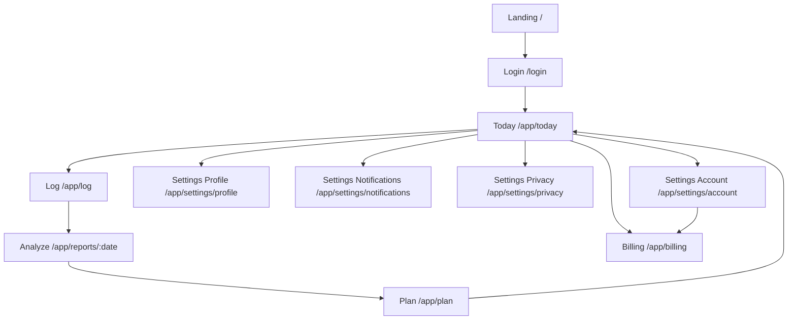

# 1. Executive Summary
- RutineIQ의 상업화 핵심은 “기록 완료율”이 아니라 “다음날 실행률”이다.
- 제품 루프를 `Today -> Log -> Analyze -> Plan -> Next day execution`으로 재정의한다.
- 설정 모달 만능 구조를 해체하고, 결제/계정삭제/데이터삭제는 전용 라우트로 분리한다.
- 45초 분석 지연은 즉시 취소/재시도/진행상태 가시화 UX로 흡수한다.
- Cohort/AI 신뢰 문구는 과장형 카피를 제거하고 데이터 충분성 기반으로 노출한다.
- North Star Metric은 `Weekly Planned Action Completion Rate (WPACR)`로 고정한다.
- 무료 사용자는 “첫 7일 루프 완주”에 집중시키고, 유료 전환은 “불확실성 감소 + 계획 유지율 향상”으로 설계한다.
- 기술적으로는 페이지 비대화를 feature 단위로 분해하고 API/캐시/상태 규칙을 표준화한다.
- 관측성(Sentry + 퍼널 이벤트 + Web Vitals) 없이 릴리즈하지 않는다.
- 3단계 릴리즈(안정화 -> 루프 강화 -> 과금 확장)로 8주 내 상업화 지표를 만든다.

# 2. Product Strategy & Metrics
## Positioning
- 대상: 번아웃 위험이 높고 일정 유지가 어려운 직장인/프리랜서/학생
- 문제: 계획은 세우지만 실행이 깨지고 회복 루틴이 없다.
- 해결: 하루 기록을 AI가 구조화하고, 다음날 실행 가능한 최소 행동을 자동 설계한다.

## Core Value Proposition (3)
1. 실행 가능한 계획: 추상 조언이 아니라 시간 블록 기반 실행안 제공
2. 회복 중심 루프: 실패 원인/회복 버퍼를 같이 설계
3. 신뢰 가능한 AI: 데이터 충분성, 표본, 확신도 노출

## Why this UX makes money
- 유료 전환은 “기능 수”가 아니라 “불확실성 감소”에서 발생한다.
- `Plan` 화면과 `Analyze` 취소/재시도 UX는 이탈을 줄여 주간 루프 유지율을 높인다.
- 결제/계정 UX를 전용 라우트로 분리하면 신뢰 손실(위험 작업 모달 처리)을 줄인다.

## North Star + Leading Indicators
- North Star: `WPACR = 주간 계획된 핵심 행동 중 완료 비율`

| Category | Metric | Definition | Target (90d) |
|---|---|---|---|
| Activation | D1 Loop Completion | 가입 후 24h 내 Log+Analyze 완료율 | >= 45% |
| Retention | W2 Return Rate | 2주차 주간 1회 이상 재방문 | >= 35% |
| Revenue | Trial->Paid | 체험/무료에서 유료 전환율 | >= 6% |
| Quality | Analyze Success <45s | 45초 내 분석 성공률 | >= 95% |
| Trust | High-Confidence Usage Share | 확신도 medium+ 카드 노출 세션 비중 | >= 70% |

## Competition / Alternatives
- 대체재: 메모앱, 습관앱, 캘린더앱, AI 챗봇
- 차별점: “기록 -> 분석 -> 내일 블록 계획”의 폐루프 자동화 + 회복 버퍼 설계

# 3. New IA & Navigation (Mermaid)


## Navigation Spec
- 데스크톱: `Today | Log | Reports | Plan | Billing`
- 모바일: `Today | Log | Reports | Plan | Sign out`
- 설정 FAB: 빠른 설정(알림/프로필) 진입용, 민감 작업은 라우트 링크만 제공

# 4. UX Audit & Redesign (25+ items)
| Journey | Problem(Observed) | Root Cause | Redesign Spec | KPI Impact | Difficulty/Risk |
|---|---|---|---|---|---|
| Onboarding | 로그인 후 첫 액션 불명확 | 홈 진입이 정보형 화면 | 기본 진입을 `/app/today`로 전환 | D1 activation + | M |
| Onboarding | CTA 분산 | 라우트/카피 불일치 | `Today->Log` 단일 주 CTA 고정 | D1 completion + | L |
| Onboarding | 프로필 필수값 누락 잦음 | 설정 진입 경로 약함 | 인사이트 경고 CTA를 `/app/settings/profile`로 직결 | Cohort usable sessions + | L |
| Log | 파싱 실패 후 사용자가 멈춤 | 재시도 가이드 약함 | 에러+재시도 버튼+원인 힌트 유지 | Log completion + | L |
| Log | 저장 후 분석 대기 이탈 | 45초 동기식 UX | 취소/진행 힌트/타임아웃 문구 추가 | Analyze success perceived + | M |
| Log | 분석 취소 불가 | abort signal 미사용 | `AbortController` 도입 | frustration - | M |
| Log | 모호한 시간 정보 피로 | 확인 배너 반복 | issue 포커스 + 우선순위 1개씩 표시 | Confirm step drop-off - | M |
| Analyze | 분석 결과 늦으면 실패로 오해 | 상태 피드백 부족 | `analyzeProgressHint` 고정 노출 | timeout retry quality + | L |
| Analyze | 새로고침 없이 stale 상태 | 캐시 정책 혼재 | background load + 오류시 stale 유지 | report reliability + | M |
| Report | 가치 지점이 아래에 묻힘 | 카드 순서 정보밀도 과다 | Hero: 한줄 코치 + 핵심행동 + 지표 우선 | perceived value + | L |
| Report | 실행 안내 약함 | 설명 중심 카피 | Primary action 1개 강조, secondary 접기 | action CTR + | L |
| Report | 신뢰 표현이 모호 | 확신도 기준 불명 | 신뢰 배지 + 데이터 충분성 문구 고정 위치 | trust + | L |
| Report | 분석 취소 불가 | 요청 제어 없음 | cancel 버튼 추가 | frustration - | M |
| Cohort | 설정 진입이 쿼리 의존 | 모달 deep-link 구조 | 전용 settings 라우트 전환 | profile completion + | L |
| Cohort | 표본 부족 시 행동 유도 약함 | 설명만 노출 | 즉시 수정 CTA(비교 기준/프로필) | cohort usable + | L |
| Settings | 결제/탈퇴가 모달에 섞임 | 모달 만능 설계 | account/privacy/billing 전용 라우트 분리 | trust + / support load - | M |
| Settings | 데이터 삭제 실수 위험 | confirm 약함 | DELETE 텍스트 2단계 확인 | critical incident - | L |
| Settings | 계정삭제 실수 위험 | confirm 약함 | DELETE 텍스트 + 별도 카드 안내 | critical incident - | L |
| Billing | redirect-only 페이지 | 실질 결제 맥락 없음 | 실제 플랜 상태 + 운영 링크 카드 | paid conversion + | M |
| Navigation | legacy 경로 혼재 | IA 전환 중 alias 부족 | `/app/insights`,`/app/daily-flow` alias 유지 + 새 경로 통일 | nav confusion - | M |
| Error | correlation 추적 어려움 | 프론트/백 상관키 부재 | `x-correlation-id` 생성/반환/기록 | MTTR - | M |
| Reliability | 500 장애 로그 맥락 부족 | 요청 식별자 없음 | 서버 에러 로그 meta에 correlation_id 추가 | MTTR - | M |
| Localization | 라벨 하드코딩 | locale 분기 scattered | 핵심 nav 라벨 `i18n.ts` 우선 | copy consistency + | M |
| Mobile | 하단 탭과 콘텐츠 간섭 가능 | 안전여백 하드코딩 | pb-safe 토큰 일관 적용 점검 | mobile completion + | M |
| Recovery | 회복 카드가 여러 위치 | 우선순위 규칙 미약 | active session > nudge > generic 순서 고정 | recovery engagement + | M |
| Performance | 단일 파일 과대 | feature 경계 부재 | feature 폴더 분리(다음 단계) | dev velocity + | H |
| Observability | 퍼널 이벤트 표준 부재 | 이벤트 명세 없음 | 이벤트 스키마 문서 + 공통 트래커 | decision speed + | M |
| QA | 실패 재현 어려움 | 시나리오 산재 | 핵심 E2E 8개 여정 고정 | release risk - | M |

# 5. Design System v1
## Tokens (Tailwind + CSS variables)
- Color: `bg`, `fg`, `muted`, `brand`, `danger`, `success`
- Radius scale: `8 / 12 / 16 / 20 / 24` (기존 card 32px 과용 축소)
- Spacing scale: `4 / 8 / 12 / 16 / 24 / 32 / 48 / 64`
- Shadow: `soft`, `elevated`, `focus`
- Typography: `title-serif`, `body`, `caption`

## Component Specs
| Component | Spec |
|---|---|
| Button | `h-10(default)`, `h-9(sm)`, `h-12(lg)`, icon spacing 8px |
| Input | `h-10`, radius 12, invalid state red border + hint |
| Card | radius 20, header 20px, content 20px, shadow-soft |
| Modal | max-width 560, max-height 84vh, scroll body, sticky footer actions |
| Tabs | min touch target 40px, active contrast >= 4.5:1 |
| Badge | 11px label, status semantic color |
| Toast | success/warn/error variant + action button |
| Skeleton | pulse 1.2s, no layout shift |

## Accessibility
- Contrast: text 최소 4.5:1, large text 3:1
- Focus ring: `2px` visible on all clickable controls
- Keyboard: tab 순서 보장, modal trap 필수
- Motion: `prefers-reduced-motion`에서 pulse/scale 감소

# 6. Engineering Refactor Plan
## Target Folder Structure
```text
apps/web/src/
  app/
    app/
      today/
      log/
      reports/[date]/
      plan/
      billing/
      settings/{profile,notifications,privacy,account}/
  features/
    insights/
    daily-flow/
    reports/
    billing/
    settings/
  components/
    app-shell/
    ui/
  lib/
    api-client.ts
    analytics.ts
    date-utils.ts
    report-utils.ts
  services/
    api/
    auth/
```

## Rules
- Server Component: auth gate, initial route-level data, SEO shell
- Client Component: form interaction, optimistic UI, local transitions
- SWR 유지: 현재 코드베이스/도입비용 대비 전환 리스크가 낮음 (TanStack Query 전환은 P2)
- API Layer:
  - typed fetch wrapper 유지 + `zod` parsing 단계적 추가
  - `x-correlation-id` mandatory
  - timeout/retry/backoff 표준화
  - abort signal 기본 지원
- Error/Loading boundaries:
  - `app/app/error.tsx`, `app/app/loading.tsx` 도입
  - 주요 세그먼트별 fallback 분리
- Cache strategy:
  - sessionStorage 의존 축소
  - SWR cache + short TTL + background revalidate
- i18n:
  - `next-intl` 단계적 도입, 기존 `i18n.ts` 브리지 유지
- Observability:
  - Sentry (error)
  - PostHog/Segment (funnel/event)
  - Web Vitals 로깅
- Testing:
  - Unit: Vitest
  - E2E: Playwright 핵심 8 시나리오
  - CI: lint/typecheck/unit/e2e-smoke
- Security/Privacy:
  - CSP + 보안 헤더
  - 계정/데이터 삭제 2단계 확인
  - rate limit (analyze, account delete)

## Migration Steps (Non-breaking)
1. IA alias 유지 + 신규 라우트 배치
2. 설정 민감 작업 라우트 분리
3. 분석 취소/진행 UX 도입
4. correlation id end-to-end 적용
5. feature 분리 리팩터 (page -> feature hooks/components)
6. i18n/observability 표준화

# 7. Feature Decisions (Cut/Keep/Add)
## Cut
- Settings 모달 내 즉시 탈퇴/데이터삭제 실행
- `/app/billing` redirect-only 동작

## Keep
- Daily diary 기반 입력 UX
- Cohort preview/official/high-confidence 3단계 모델
- SWR 기반 캐시/리밸리데이트

## Add
- `/app/today`, `/app/log`, `/app/plan` 루프 라우트
- Settings 전용 라우트(`profile/notifications/privacy/account`)
- Analyze cancel/retry/progress UX
- Correlation ID 추적 체계
- 결제 관리 페이지의 플랜 상태/운영 동선

# 8. Execution Backlog (Epics/Stories/Tasks, 40+)
> 상세 Story는 `docs/PRODUCT_REWRITE_STORY_BACKLOG_2026-02-19.md` 참조.

## Epic 목록
- E1 IA/Navigation
- E2 Onboarding/Activation
- E3 Log/Analyze UX
- E4 Report Value & Trust
- E5 Settings/Billing/Safety
- E6 Platform Reliability/Observability
- E7 QA/Release Automation

# 9. Release Plan & Success Criteria
## Stage 1: Stabilize (Week 1-2)
- 범위: IA 전환, settings 분리, analyze 취소/진행 UX, correlation id
- 성공 기준:
  - Analyze timeout 유저 불만 세션 비율 30% 감소
  - 계정/데이터 삭제 오동작 0건
  - 주요 라우트 전환 오류 0건

## Stage 2: Improve Loop (Week 3-5)
- 범위: Today/Plan 루프 강화, 리포트 hero 우선순위 개선, 이벤트 스키마
- 성공 기준:
  - D1 Loop completion +10%p
  - W2 Return +6%p
  - Report action 클릭률 +20%

## Stage 3: Monetize & Scale (Week 6-8)
- 범위: billing 확장, paywall 실험, onboarding personalization
- 성공 기준:
  - Trial->Paid +2%p
  - 결제 이탈률 -15%
  - NPS/CSAT 개선(지원 티켓당 부정 피드백 감소)

# 10. Assumptions & Risks
## Assumptions
- 현재 Supabase schema(`profiles`, `activity_logs`, `ai_reports`, `subscriptions`)는 유지 가능
- 분석 API SLA는 45초 내 95% 달성이 가능
- 모바일 웹이 우선 채널이며 네이티브 앱은 당장 범위 아님

## Risks
- R1: 페이지 분해 중 회귀
  - 완화: feature 단위 incremental PR + e2e smoke
- R2: 결제 UX 변경에 따른 전환 변동성
  - 완화: stage rollout + experiment flags
- R3: i18n 전환 중 문구 누락
  - 완화: key audit script + fallback locale
- R4: 분석 지연 체감
  - 완화: cancel/retry/background 안내 + notifications
