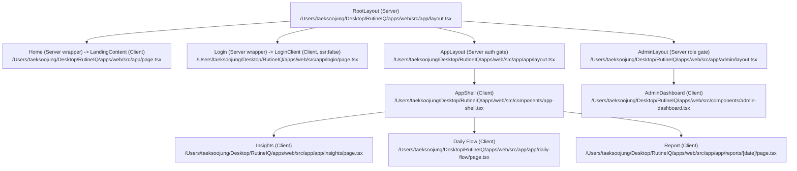
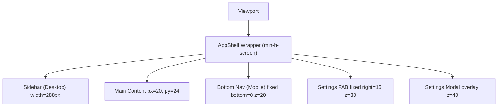
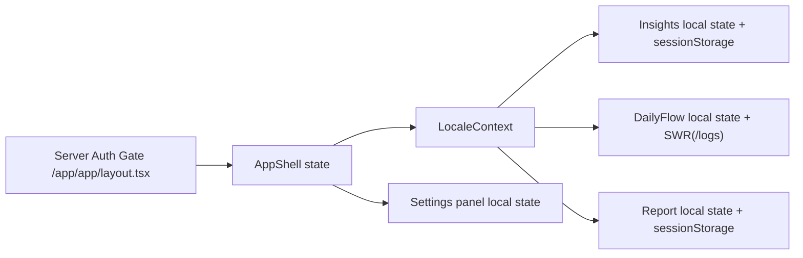
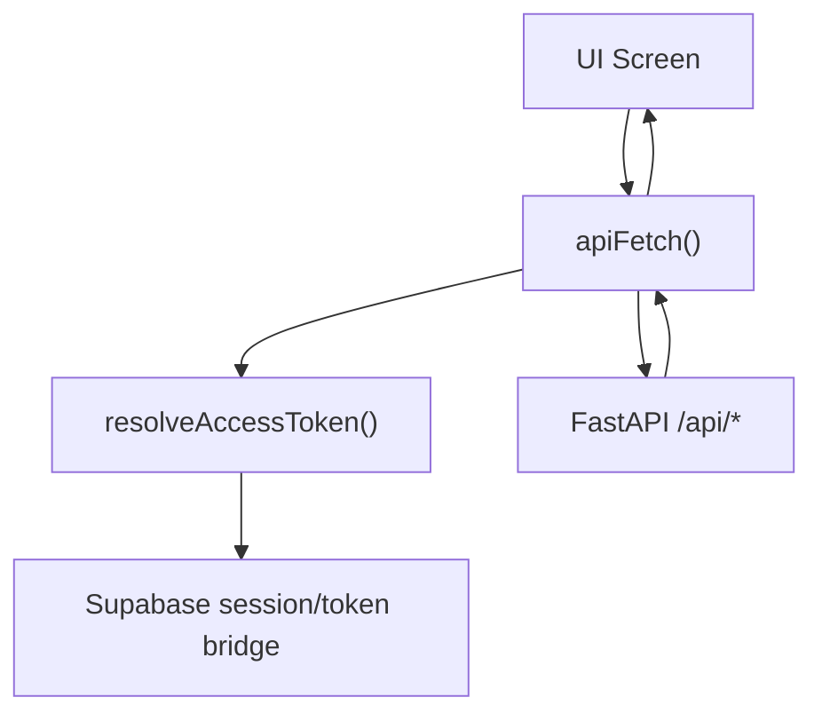

# RutineIQ Web/Mobile UI Structure Audit (Code-Fact Based)

- Generated: 2026-02-18
- Scope: `/Users/taeksoojung/Desktop/RutineIQ`
- Method: source code + test config inspection (no speculative assumptions)
- Rule: Confirmed / Partial / Unknown status labels attached per item

## [1] 기술 스택 및 렌더링 구조

### 1-1. 확인 결과 요약
| 항목 | 사실 | 근거 파일 | 상태 |
|---|---|---|---|
| Web 기술 스택 | Next.js `14.2.35`, React `18.3.1`, React DOM `18.3.1`, SWR `2.4.0`, Tailwind `3.4.19` | `/Users/taeksoojung/Desktop/RutineIQ/apps/web/node_modules/*/package.json` | Confirmed |
| Web 런타임 구조 | Next App Router(`src/app`), Server Component + Client Component 혼합 | `/Users/taeksoojung/Desktop/RutineIQ/apps/web/src/app` | Confirmed |
| API 백엔드 | FastAPI `0.115.6`, `/api/*` 라우터 포함 | `/Users/taeksoojung/Desktop/RutineIQ/apps/api/app/main.py`, `/Users/taeksoojung/Desktop/RutineIQ/apps/api/requirements.txt` | Confirmed |
| Mobile 기술 스택(네이티브) | 이 저장소 내 `React Native/Expo/Flutter` 코드 없음 | 저장소 전역 검색 결과 | Confirmed (repo scope) |
| 라우팅 구조(Web) | 파일 기반 라우팅(App Router) | `/Users/taeksoojung/Desktop/RutineIQ/apps/web/src/app/*` | Confirmed |
| SSR/CSR | `layout.tsx`/`app/app/layout.tsx`/`admin/layout.tsx`는 서버, 주요 화면(`insights/daily-flow/reports`)은 클라이언트 | 각 파일의 `"use client"`/server 코드 | Confirmed |
| 공통 Layout | 루트: `/Users/taeksoojung/Desktop/RutineIQ/apps/web/src/app/layout.tsx`, 앱: `/Users/taeksoojung/Desktop/RutineIQ/apps/web/src/app/app/layout.tsx`, 관리자: `/Users/taeksoojung/Desktop/RutineIQ/apps/web/src/app/admin/layout.tsx` | 해당 파일 | Confirmed |
| 디자인 시스템 | Tailwind + shadcn/ui + Radix + CVA | `/Users/taeksoojung/Desktop/RutineIQ/apps/web/tailwind.config.ts`, `/Users/taeksoojung/Desktop/RutineIQ/apps/web/components.json`, `/Users/taeksoojung/Desktop/RutineIQ/apps/web/src/components/ui/*` | Confirmed |

### 1-2. 트리 구조 다이어그램


## [2] 화면별 구조 트리 (Screen-Level Breakdown)

### Screen: `/`
- 파일 경로: `/Users/taeksoojung/Desktop/RutineIQ/apps/web/src/app/page.tsx` + `/Users/taeksoojung/Desktop/RutineIQ/apps/web/src/components/landing-content.tsx`
- 상위 Layout: `/Users/taeksoojung/Desktop/RutineIQ/apps/web/src/app/layout.tsx`
- 상태 소유 위치: `LandingContent` 내부 `useState(lang, langOpen, mounted)`
- 사용 API: 없음
- Feature Flag 의존: 없음
- 상태: Confirmed

```text
RootLayout
└─ HomePage
   └─ LandingContent
      ├─ Sticky Nav (브랜드 + 언어선택)
      ├─ Hero Section (메인 카피/CTA)
      ├─ 3 Cards Section
      ├─ Feature Section
      ├─ Closing CTA
      └─ Fixed Footer(스폰서/프라이버시)
```

### Screen: `/login`
- 파일 경로: `/Users/taeksoojung/Desktop/RutineIQ/apps/web/src/app/login/page.tsx` + `/Users/taeksoojung/Desktop/RutineIQ/apps/web/src/components/login-client.tsx`
- 상위 Layout: `/Users/taeksoojung/Desktop/RutineIQ/apps/web/src/app/layout.tsx`
- 상태 소유 위치: `LoginClient` 내부 (`tab`, `loading`, `error`, `googleEnabled`, `inAppBrowser` 등)
- 사용 API: Supabase Auth SDK + `fetch {SUPABASE_URL}/auth/v1/settings`
- Feature Flag 의존: `NEXT_PUBLIC_SUPABASE_*`, 인앱브라우저 분기, Google provider 활성 여부
- 상태: Confirmed

```text
RootLayout
└─ LoginPage(Suspense)
   └─ LoginClient (dynamic, ssr:false)
      ├─ Back Link + Language Dropdown
      ├─ Auth Card
      │  ├─ Tab(Login/Signup)
      │  ├─ Google OAuth Button
      │  └─ Email/Password Form
      └─ Privacy Note
```

### Screen: `/app/insights`
- 파일 경로: `/Users/taeksoojung/Desktop/RutineIQ/apps/web/src/app/app/insights/page.tsx`
- 상위 Layout: `/Users/taeksoojung/Desktop/RutineIQ/apps/web/src/app/layout.tsx` → `/Users/taeksoojung/Desktop/RutineIQ/apps/web/src/app/app/layout.tsx` → `/Users/taeksoojung/Desktop/RutineIQ/apps/web/src/components/app-shell.tsx`
- 상태 소유 위치: `InsightsPage` 로컬 상태 + `sessionStorage` 캐시(리포트)
- 사용 API: `/logs`, `/reports`, `/analyze`, `/insights/weekly`, `/trends/cohort`, `/preferences/profile`, `/recovery/*`, `/trends/cohort/event`
- Feature Flag 의존: `preview_mode`, `threshold_variant`, `confidence_level`(백엔드 응답 기반), `isE2ETestMode()` 분기
- 상태: Confirmed

```text
AppShell
└─ InsightsPage
   ├─ Header(타이틀/오늘 날짜)
   ├─ Alert Blocks(profile missing / recovery nudge / recovery active)
   ├─ Main Grid(lg 12 cols)
   │  ├─ Coach Card
   │  ├─ Trust Badge
   │  ├─ Next Action Card
   │  ├─ Tomorrow Schedule Card
   │  ├─ Cohort Trend Card
   │  └─ Report Deep Dive Card
   └─ Details(expandable)
      ├─ Consistency Card(차트)
      └─ Weekly Snapshot Card
```

### Screen: `/app/daily-flow`
- 파일 경로: `/Users/taeksoojung/Desktop/RutineIQ/apps/web/src/app/app/daily-flow/page.tsx`
- 상위 Layout: `/Users/taeksoojung/Desktop/RutineIQ/apps/web/src/app/app/layout.tsx` → `/Users/taeksoojung/Desktop/RutineIQ/apps/web/src/components/app-shell.tsx`
- 상태 소유 위치: `DailyFlowPage` 로컬 상태 + SWR(`useSWR`, `useSWRConfig`)
- 사용 API: `GET /logs?date=...`, `POST /parse-diary`, `POST /logs`, `POST /analyze`, `POST /trends/cohort/event`
- Feature Flag 의존: telemetry payload 내 `threshold_variant/control` 고정값, `preview_mode` 고정 `false`, E2E 모드 간접 의존
- 상태: Confirmed

```text
AppShell
└─ DailyFlowPage
   ├─ Page Header(타이틀/서브타이틀)
   ├─ Date Navigator
   ├─ Error Banner(+ retry)
   ├─ Step: write
   │  └─ Textarea + Parse CTA
   ├─ Step: confirm
   │  ├─ Parsed Header + Retry
   │  ├─ Issue Banner
   │  ├─ Parsed Entry List(편집/시간창 선택/증거표시)
   │  ├─ Parsed Meta Chips
   │  └─ Save Actions
   └─ Step: done
      └─ Analyze CTA
```

### Screen: `/app/reports/[date]`
- 파일 경로: `/Users/taeksoojung/Desktop/RutineIQ/apps/web/src/app/app/reports/[date]/page.tsx`
- 상위 Layout: `/Users/taeksoojung/Desktop/RutineIQ/apps/web/src/app/app/layout.tsx` → `/Users/taeksoojung/Desktop/RutineIQ/apps/web/src/components/app-shell.tsx`
- 상태 소유 위치: `ReportPage` 로컬 상태 + `sessionStorage` 캐시
- 사용 API: `GET /reports?date=...`, `POST /analyze`
- Feature Flag 의존: 없음(단, 데이터 품질/티어 표기는 서버 응답 기반)
- 상태: Confirmed

```text
AppShell
└─ ReportPage
   ├─ Header(날짜 입력 + Analyze + Reload)
   ├─ Error Banner
   ├─ Loading Skeleton Grid
   ├─ Empty Preview Card(보고서 없음)
   └─ Report Grid
      ├─ Hero(One-liner + next action + 3 key metrics)
      ├─ Trust Badge
      ├─ AI Quality Card
      ├─ Day Review Card
      ├─ Wellbeing Card
      ├─ Micro Advice Card
      ├─ Power Hours Card(타임라인 바 absolute)
      ├─ Failure Patterns Card
      ├─ Tomorrow Plan Card(+ ICS export)
      └─ If-Then Rules Card
```

### Screen: `/admin`
- 파일 경로: `/Users/taeksoojung/Desktop/RutineIQ/apps/web/src/app/admin/layout.tsx` + `/Users/taeksoojung/Desktop/RutineIQ/apps/web/src/components/admin-dashboard.tsx`
- 상위 Layout: `/Users/taeksoojung/Desktop/RutineIQ/apps/web/src/app/layout.tsx` → `/Users/taeksoojung/Desktop/RutineIQ/apps/web/src/app/admin/layout.tsx` → `/Users/taeksoojung/Desktop/RutineIQ/apps/web/src/components/app-shell.tsx`
- 상태 소유 위치: `AdminDashboard` 로컬 상태(`users`, `detail`, `errors`)
- 사용 API: `/admin/users`, `/admin/errors`, `/admin/users/:id`, `/admin/sync-subscription/:id`
- Feature Flag 의존: 없음(권한은 서버 role 체크)
- 상태: Confirmed

## [3] 레이아웃 수치 및 위치 (코드 기준 px/% 단위)

기준 viewport:
- Desktop: `1280x800` (`/Users/taeksoojung/Desktop/RutineIQ/apps/web/e2e/responsive-layouts.spec.ts`)
- Mobile: `375x812` (동일 파일)
- Tablet: `768x1024` (동일 파일)

### 3-1. 공통 AppShell(`/app/*`)
| 항목 | Desktop(>=768) | Mobile(<768) | 근거 | 상태 |
|---|---|---|---|---|
| 외곽 레이아웃 | `md:flex` | block | `/Users/taeksoojung/Desktop/RutineIQ/apps/web/src/components/app-shell.tsx` | Confirmed |
| 사이드바 폭 | `w-72` = `288px`, `p-5`=`20px` | hidden | 동일 | Confirmed |
| 메인 패딩 | `px-5`=`20px`, `py-6`=`24px`, `pb-6`=`24px` | `px-5`=`20px`, `py-6`=`24px`, `pb-24`=`96px` | 동일 | Confirmed |
| 하단 내비 | hidden | `position: fixed; bottom:0; left:0; right:0; z-20` | 동일 | Confirmed |
| 모바일 탭 높이 | - | `min-height:68px` | 동일 | Confirmed |
| 상단 헤더 높이 | 고정값 없음 | 고정값 없음 | 코드에 `h-*` 없음 | Partial |
| 스크롤 컨테이너 | 문서 스크롤(주 `main` overflow 지정 없음) | 동일 | 동일 | Partial |

### 3-2. Settings FAB/Modal(앱 공통)
| 항목 | 값 | 근거 | 상태 |
|---|---|---|---|
| FAB 위치 | `position:fixed; right:16px; bottom:calc(5.5rem + safe-area)` / `md:bottom:20px`; `z-30` | `/Users/taeksoojung/Desktop/RutineIQ/apps/web/src/components/app-settings-panel.tsx` | Confirmed |
| Modal Overlay | `fixed inset-0 z-40` | 동일 | Confirmed |
| Modal Box | `width:min(92vw,560px)`, `max-height:84vh`, `aspect-square`, `overflow-hidden` | 동일 | Confirmed |
| Modal 본문 스크롤 | `overflow-y-auto` | 동일 | Confirmed |

### 3-3. `/app/insights`
| 항목 | 값 | 근거 | 상태 |
|---|---|---|---|
| 컨테이너 max-width | `max-w-6xl` = `1152px` | `/Users/taeksoojung/Desktop/RutineIQ/apps/web/src/app/app/insights/page.tsx` | Confirmed |
| grid gap | `gap-4` = `16px` | 동일 | Confirmed |
| 레이아웃 전환 | `lg:grid-cols-12` (`>=1024`) | 동일 | Confirmed |
| 주요 카드 높이 | 고정 높이 없음(내용 기반), 차트 박스 `h-32`=`128px` | 동일 | Partial |
| fixed/absolute | 페이지 자체 fixed 없음(상위 AppShell/nav/settings 영향) | 동일 | Confirmed |
| overflow | details/카드 내부 기본 overflow, 별도 스크롤 강제 없음 | 동일 | Partial |

### 3-4. `/app/daily-flow`
| 항목 | 값 | 근거 | 상태 |
|---|---|---|---|
| 컨테이너 max-width | `max-w-3xl` = `768px` | `/Users/taeksoojung/Desktop/RutineIQ/apps/web/src/app/app/daily-flow/page.tsx` | Confirmed |
| 하단 패딩 | mobile `pb-24`=`96px`, desktop `md:pb-6`=`24px` | 동일 | Confirmed |
| 상단 날짜 바 패딩 | `px-2 py-2` = `8px/8px` | 동일 | Confirmed |
| 텍스트 영역 높이 | `min-h-[200px]` | 동일 | Confirmed |
| 입력 시간 필드 | `h-8`, 활동 편집 `h-9` | 동일 | Confirmed |
| fixed/absolute | entry-row 내 추천버튼 `absolute right-2 top-1/2` (행 내부) | `/Users/taeksoojung/Desktop/RutineIQ/apps/web/src/app/app/daily-flow/entry-row.tsx` | Confirmed |

### 3-5. `/app/reports/[date]`
| 항목 | 값 | 근거 | 상태 |
|---|---|---|---|
| 컨테이너 max-width | `max-w-6xl`=`1152px` | `/Users/taeksoojung/Desktop/RutineIQ/apps/web/src/app/app/reports/[date]/page.tsx` | Confirmed |
| 상단 입력 폭 | 날짜 input `w-[160px]` | 동일 | Confirmed |
| 그리드 | `lg:grid-cols-12`, `gap-4`=`16px` | 동일 | Confirmed |
| 타임라인 박스 | `h-10`=`40px` | 동일 | Confirmed |
| 타임라인 바 | `absolute top:50%`, `height:20px`, `left:%`, `width:%` 동적 | 동일 | Confirmed |
| fixed/absolute | 페이지 자체 fixed 없음(상위 AppShell 영향) | 동일 | Confirmed |

### 3-6. `/login`
| 항목 | 값 | 근거 | 상태 |
|---|---|---|---|
| 컨테이너 | `max-w-md`=`448px`, `px-6`=`24px`, `py-10`=`40px`, `min-h-screen` | `/Users/taeksoojung/Desktop/RutineIQ/apps/web/src/components/login-client.tsx` | Confirmed |
| 카드 패딩 | `p-8`=`32px` | 동일 | Confirmed |
| 탭 높이 | 버튼 높이 `py-2` + 텍스트 기반(auto) | 동일 | Partial |
| fixed 요소 | 언어 dropdown 오버레이 `fixed inset-0 z-20`; dropdown `absolute right-0 top-full z-30 w-32(128px)` | 동일 | Confirmed |
| header/footer | 별도 고정 헤더/푸터 없음 | 동일 | Confirmed |

### 3-7. `/` 랜딩
| 항목 | 값 | 근거 | 상태 |
|---|---|---|---|
| 메인 하단 패딩 | `pb-32`=`128px`, `md:pb-24`=`96px` | `/Users/taeksoojung/Desktop/RutineIQ/apps/web/src/components/landing-content.tsx` | Confirmed |
| 상단 nav | `sticky top-0 z-30`, `px-6 py-4`, `md:px-10` | 동일 | Confirmed |
| Hero width | `max-w-3xl`=`768px`, `px-6`, `pt-14`=`56px`, `md:pt-24`=`96px` | 동일 | Confirmed |
| 카드 섹션 | `max-w-4xl`=`896px`, `grid md:grid-cols-3`, `gap-5`=`20px` | 동일 | Confirmed |
| 하단 footer | `fixed bottom-0 left-0 right-0 z-40`, `px-4 py-3` | 동일 | Confirmed |
| footer 높이 | 고정값 없음(내용 기반 auto) | 동일 | Partial |

### 3-8. z-index 계층(확인값)
| 레벨 | 요소 | 근거 | 상태 |
|---|---|---|---|
| `-z-10` | 루트 배경 radial layer | `/Users/taeksoojung/Desktop/RutineIQ/apps/web/src/app/layout.tsx` | Confirmed |
| `z-15` | `.sticky-actions` 클래스(정의만, 사용처 없음) | `/Users/taeksoojung/Desktop/RutineIQ/apps/web/src/app/globals.css` | Confirmed |
| `z-20` | 모바일 하단 nav, 로그인/랜딩 overlay | `app-shell.tsx`, `login-client.tsx`, `landing-content.tsx` | Confirmed |
| `z-30` | 설정 FAB, 랜딩 sticky nav/dropdown | `app-settings-panel.tsx`, `landing-content.tsx` | Confirmed |
| `z-40` | 설정 모달 overlay, 랜딩 fixed footer/dropdown | `app-settings-panel.tsx`, `landing-content.tsx` | Confirmed |

## [4] 반응형 구조

| 항목 | 내용 | 근거 | 상태 |
|---|---|---|---|
| Breakpoints 정의 위치 | Tailwind config에 `screens` 커스텀 없음(기본 breakpoint 사용) | `/Users/taeksoojung/Desktop/RutineIQ/apps/web/tailwind.config.ts` | Confirmed |
| Breakpoint 값 | `sm 640`, `md 768`, `lg 1024`, `xl 1280`, `2xl 1536` (Tailwind 기본) | Tailwind 기본 + config 미재정의 | Partial |
| 전환 지점(주요) | `md`: sidebar on / bottom-nav off, `lg`: insights/reports 12-col | `app-shell.tsx`, `insights/page.tsx`, `reports/[date]/page.tsx` | Confirmed |
| 모바일 전용 분기 코드 | `md:hidden`, `md:flex`, `safe-area`, swipe gesture | `app-shell.tsx`, `daily-flow/page.tsx`, `globals.css` | Confirmed |
| Web/Mobile UI 차이점 | 네이티브 앱 분리 없음, 반응형 Web 단일 코드베이스 | 저장소 구조 | Confirmed (repo scope) |

## [5] 상태 관리 구조 (State Ownership Map)

### 5-1. 요약
| 항목 | 내용 | 근거 | 상태 |
|---|---|---|---|
| 전역 상태 저장소(Redux/Zustand) | 없음 | 저장소 검색 | Confirmed |
| 전역 컨텍스트 | `LocaleContext`만 존재 | `/Users/taeksoojung/Desktop/RutineIQ/apps/web/src/components/locale-provider.tsx` | Confirmed |
| 서버 상태 캐싱 | Daily Flow는 SWR, Insights/Report는 `sessionStorage` TTL 캐시 | `daily-flow/page.tsx`, `insights/page.tsx`, `reports/[date]/page.tsx` | Confirmed |
| 인증 상태 | Server layout에서 session gate + client auth sync | `app/app/layout.tsx`, `app-shell.tsx` | Confirmed |
| Web/Mobile 상태 구조 차이 | 네이티브 모바일 앱 코드 없음 | 저장소 구조 | Confirmed (repo scope) |

### 5-2. ASCII 그래프
```text
Server Layer
 ├─ RootLayout (metadata/theme shell)
 ├─ AppLayout (Supabase session gate)
 └─ AdminLayout (role=admin gate)

Client Layer
 ├─ LocaleContext (LocaleProvider)
 ├─ AppShell
 │   ├─ locale
 │   ├─ resolvedRole/resolvedEmail
 │   └─ userMetaVersion (reminder refresh trigger)
 ├─ DailyFlowPage
 │   ├─ SWR /logs?date=...
 │   ├─ step/write/confirm/done
 │   └─ parse/save/analyze local states
 ├─ InsightsPage
 │   ├─ report cache (sessionStorage, 5m TTL)
 │   ├─ cohort/weekly/recovery local states
 │   └─ telemetry dispatch state
 ├─ ReportPage
 │   ├─ report cache (sessionStorage, 10m TTL)
 │   └─ loading/analyzing/exporting local states
 └─ AppSettingsPanel
     ├─ modal open/tab state
     ├─ profile/reminder/account local states
     └─ Supabase user metadata sync
```

## [6] API ↔ UI 연결 구조

### 6-1. API 클라이언트 / timeout / abort / error
| 항목 | 사실 | 근거 | 상태 |
|---|---|---|---|
| API 클라이언트 파일 경로 | `/Users/taeksoojung/Desktop/RutineIQ/apps/web/src/lib/api-client.ts` | 파일 확인 | Confirmed |
| URL 정규화 | `${origin}/api/...` 강제 (`/api/api` 중복 제거) | 동일 | Confirmed |
| 인증 헤더 | Bearer 토큰 자동 부착(E2E 제외) | 동일 | Confirmed |
| timeout/abort | GET/HEAD 기본 20s, mutation 기본 90s, AbortController 사용 | 동일 | Confirmed |
| 재시도 | idempotent method timeout 시 1회 재시도 | 동일 | Confirmed |
| 에러 처리 | `detail/message/hint/code` 정규화 후 `ApiFetchError` throw | 동일 | Confirmed |
| feature flag 처리 방식 | env + 응답필드 기반 분기(`preview_mode`, `threshold_variant`) | `api-client.ts`, `insights/page.tsx`, `daily-flow/page.tsx` | Confirmed |
| correlation id 전달 여부 | 요청 측 명시 전달 없음. 일부 Recovery 응답 payload로만 수신 | `api-client.ts`, `insights/page.tsx` | Confirmed |

### 6-2. 화면별 endpoint
| 화면 | endpoint | 메서드 | 상태 |
|---|---|---|---|
| `/app/daily-flow` | `/logs?date=...`, `/parse-diary`, `/logs`, `/analyze`, `/trends/cohort/event` | GET/POST | Confirmed |
| `/app/insights` | `/logs`, `/reports`, `/analyze`, `/insights/weekly`, `/trends/cohort`, `/preferences/profile`, `/recovery/active`, `/recovery/nudge`, `/recovery/nudge/ack`, `/trends/cohort/event` | GET/POST | Confirmed |
| `/app/reports/[date]` | `/reports?date=...`, `/analyze` | GET/POST | Confirmed |
| `/admin` | `/admin/users`, `/admin/errors`, `/admin/users/:id`, `/admin/sync-subscription/:id` | GET/POST | Confirmed |
| Settings Panel | `/preferences/profile`, `/preferences/data`, `/preferences/account` | GET/PUT/DELETE | Confirmed |
| BillingActions | `/stripe/status`, `/stripe/create-checkout-session` | GET/POST | Confirmed |

## [7] 디자인 시스템 및 스타일링 구조

| 항목 | 사실 | 근거 | 상태 |
|---|---|---|---|
| 스타일링 방식 | Tailwind utility + 일부 inline style | `/Users/taeksoojung/Desktop/RutineIQ/apps/web/src/app/globals.css`, component files | Confirmed |
| 공통 토큰 | CSS 변수(`--bg`, `--fg`, `--brand` 등) + Tailwind extend token | `/Users/taeksoojung/Desktop/RutineIQ/apps/web/src/app/globals.css`, `/Users/taeksoojung/Desktop/RutineIQ/apps/web/tailwind.config.ts` | Confirmed |
| 컴포넌트 라이브러리 | shadcn/ui + Radix + CVA | `/Users/taeksoojung/Desktop/RutineIQ/apps/web/components.json`, `/Users/taeksoojung/Desktop/RutineIQ/apps/web/src/components/ui/*` | Confirmed |
| 중복 스타일 | 랜딩/로그인에 inline style 다수 | `/Users/taeksoojung/Desktop/RutineIQ/apps/web/src/components/landing-content.tsx`, `/Users/taeksoojung/Desktop/RutineIQ/apps/web/src/components/login-client.tsx` | Confirmed |
| 인라인 스타일 위치 | AppShell 배경 gradient, Landing visual, Report timeline bar 등 | `app-shell.tsx`, `landing-content.tsx`, `reports/[date]/page.tsx` | Confirmed |
| 테마 전환 구조 | light 고정(`data-theme="light"`, `color-scheme: light`) | `/Users/taeksoojung/Desktop/RutineIQ/apps/web/src/app/layout.tsx`, `/Users/taeksoojung/Desktop/RutineIQ/apps/web/src/app/globals.css` | Confirmed |

## [8] 기술 부채 및 구조적 제약

| 영역 | 리스크 | 근거 | 회귀 위험 | 상태 |
|---|---|---|---|---|
| Insights 단일 파일(1574 lines) | High Risk | `/Users/taeksoojung/Desktop/RutineIQ/apps/web/src/app/app/insights/page.tsx` | fetch/정규화/UI/telemetry 결합 | Confirmed |
| Daily Flow 단일 파일(1180 lines) | High Risk | `/Users/taeksoojung/Desktop/RutineIQ/apps/web/src/app/app/daily-flow/page.tsx` | step/parse/save/telemetry 결합 | Confirmed |
| AppSettingsPanel 단일 파일(914 lines) | High Risk | `/Users/taeksoojung/Desktop/RutineIQ/apps/web/src/components/app-settings-panel.tsx` | 알림/프로필/데이터/계정 결합 | Confirmed |
| AppShell 책임 과다 | Medium Risk | `/Users/taeksoojung/Desktop/RutineIQ/apps/web/src/components/app-shell.tsx` | auth/locale/nav/reminder 결합 | Confirmed |
| endpoint 문자열 분산 | Medium Risk | 다수 파일 `apiFetch("/...")` | 라우트 rename 시 광범위 영향 | Confirmed |
| 랜딩/로그인 inline 스타일 다량 | Medium Risk | `landing-content.tsx`, `login-client.tsx` | 토큰 변경/브랜드 리뉴얼 시 누락 위험 | Confirmed |
| `.sticky-actions` 미사용 스타일 | Low Risk | `/Users/taeksoojung/Desktop/RutineIQ/apps/web/src/app/globals.css` | dead CSS 누적 | Confirmed |

## [9] 시각화

### 9-1. 레이아웃 박스 다이어그램


### 9-2. 상태 의존 그래프


### 9-3. API 흐름


## 부록: 확인 상태 기준
- Confirmed: 코드/설정/테스트 파일에서 직접 확인 가능
- Partial: 일부는 확인되지만 수치/행동이 런타임 계측 없이는 완전확정 불가
- Unknown: 코드/설정에서 근거를 찾지 못함

